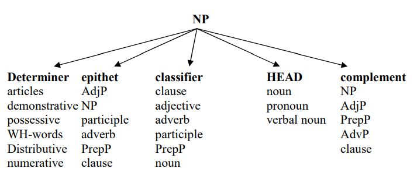
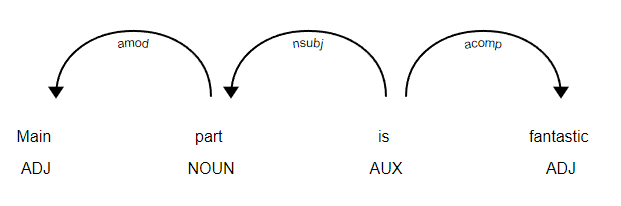
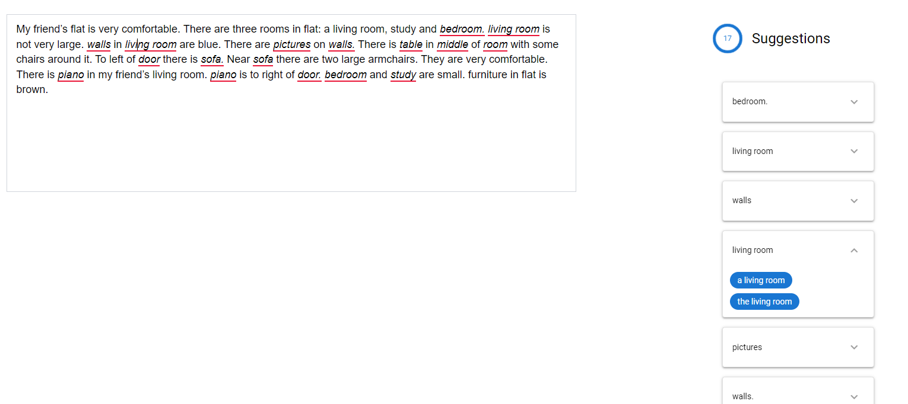
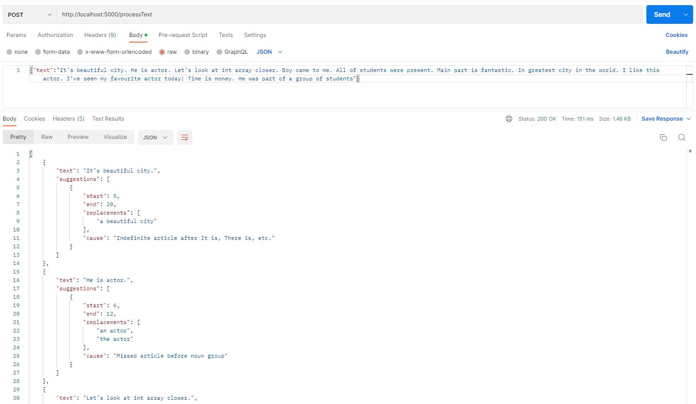
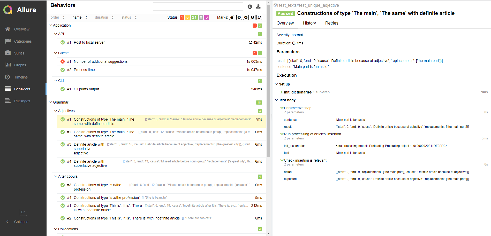

### Overview
The given project is dedicated to accomplish processing of natural language, namely _inserting article if it misses in the sentence._</br>
Besides script methods to process a text or a particular sentence, there are also CLI and WEB (local) applications to try.<br>
Rules by which it is decided whether there is need to insert an article are given below. The list is not exhaustive and open to be replenished :-) .

### Stack
Text processing:
- Python 3.9
- nltk==3.8
  
Testing:
- Gutenberg==0.8.2
- pytest==7.2.0
- allure-pytest==2.12.0
  
Applications:
- click==8.1.3
- Flask==2.2.2

Please, install requirements first, e.g. `pip install -r requirements.txt` (see also Gutenberg below)

### Grammar Rules:
The whole idea of inserting missing article is based on understanding whether a noun group contains some determinative or not. On the next scheme it is represented which elements could occur in NP and its positions.
 <br> [see at http://www.ugr.es/~ftsaez/morfo/nouns.pdf]

As it is described in scheme - determinative goes first in every NP. So that the mechanism is to extract NP from sentence, indicate a determinative, if itl doesn't exist - add an article in first position.<br>
We don't consider now all possible elements of a noun group, e.g. complement (which in most cases implies usage of definite article) or clauses as epithets or classifiers.
In next section we describe which cases are covered.

1. ##### Noun groups (noun phrases, NPs) extracting

To extract NPs Regex Chunking is used.
E.g. sentence _Main part is fantastic_, which syntax structure can be represented as<br>


and will be resolved in following sentence tree (S) with subtrees (NP):<br>
_(S (NP Main/ADJ part/NOUN) is/AUX fantastic./ADJ)_<br>

By following patterns chunker extracts proposed groups in sentence and shows it as subtrees.
The grammar uses abbreviations in according with nltk library POS tagging https://www.guru99.com/pos-tagging-chunking-nltk.html:
```
                EXIND: {<DT|EX|IT>+<VBZ|VBD>+<DT>?<JJ>*<NN>+}
                VBPART: {<VBZ|VBD><NN>+<IN>+}
                NPP: {<DT>+<NN>?<IN>?<CD>?<DT|PRP\$>?<JJS|JJ|JJR>*<NN|NNS>+}
                NP: {<CD>?<DT|PRP\$>?<JJS|JJ|JJR>*<NN|NNS>+}
```

Order of rules means prioritization: first match is selected, if selected others are not to process.  

**EXIND** (existence+indefinite) means groups that start with _It is, There is,_ etc. This start invokes that further only indefinite article is applicable.
Possible examples: <br>
- this is (a) nice kitten
- there was (a) cat

**VBPART** (verb+"part") means verb "to be" + part (noun), e.g. <i>He was a part of ...</i><br>
It goes before NP extracting because there are similar constructions noun+preposition+noun in NP-groups which could be interpreted as one that needs an article,
while this particular case doesn't. 

**NP** means a noun group which can include different qualifiers. It definitely includes a noun itself, could include from 0 to infinity adjectives,
some sort of determiner (article, possessive pronoun, cardinal digit). Possible examples could be:

- kittens
- adorable kittens
- funny adorable kittens
- my kittens
- my funny adorable kittens
- two kittens
- two funny adorable kittens


**NPP** means a complex NP group with two nouns linked by preposition. Possible constructions<br>
- (a) toy of two kittens
- (a) toy of two funny adorable kittens


2. #### NP analysing and article inserting
There are two main flows to resolve article's inserting: in NP and in NPP groups.
Before inserting there are prechecks whether inserting is needed:
no need when noun is uncountable, Named Entity, or there is already a determinative in group.

Also checks for cases when only definite article is applicable: for plural forms or in cases with superlative adjective.

Let's look deeper at example
```
        elif subtree.label() == 'NP':
            if is_noun_uncountable(subtree, uncountable_nouns_list) or is_determinative_in_group(
                    pos_leaves) or is_named_entity(subtree.leaves()):
                empty_suggestion()
            else:
                tree_processing_result.concat(resolve_np_group(phrase, pos_leaves, words_leaves))
```
For NP group extracted by chunker, it resolves first if noun is uncountable, if there is some determinative (could be cardinal or possessive pronoun as well) or if the noun is some Named entity. If not, we will insert article by following rules:
```
    if is_noun_plural(pos_leaves) or is_jj_superlative(pos_leaves) or has_unique_jj(
            words_leaves, pos_leaves):
        subtree_processing_result = insert_article_in_tree(0, 'the', words_leaves,
                                                           "Definite article because of plural form" if is_noun_plural(
                                                               pos_leaves) else "Definite article because of adjective")
    else:
        dt: str = resolve_vowel(phrase,words_leaves[0])
        subtree_processing_result = insert_article_in_tree(0, dt,
                                                           words_leaves, "Missed article before noun group")
        subtree_processing_resultThe = insert_article_in_tree(0, 'the',
                                                              words_leaves, "Missed article before noun group")
        subtree_processing_result.suggestions[0].replacements.append(
            subtree_processing_resultThe.suggestions[0].replacements[0]
        )
    return subtree_processing_result
```

If there is a unique adjective as post-determiner or superlative adjective, only definite article is applicable:
- the last part
- the highest mountain<br>

As well as with plural noun.
Otherwise it creates two trees with inserted articles.

E.g. <br>
Sentence: He is actor<br>
Tree: (S He/PRP is/VBZ (NP actor./NN)) <br>
Subtree: (NP actor./NN)<br>

_actor_ is countable, is not Named entity, there is no determinative. It is not plural and does not have "the"-adjectives. So both variants will be proposed:<br>
He is an actor/He is the actor

_An_ instead of _a_ processed by resolve_vowel method.

3. #### Dictionaries
There are a few dictionaries to help to make adequate processing.
- resources/dictionaries/contractions.json - dictionary of contractions of type it's -> it is so that POS tagging has more chances to recognize correctly
- resources/dictionaries/fix_pos_tagging_dict.json - if POS tagger failed, you can add an additional rule here
- resources/dictionaries/uncountable_nouns_list.json - dictionary of uncountable nouns
- resources/moby_dick - if you want to test on some huge text

4. #### Why my sentence is not processed correctly?
Apart from the fact that maybe your case is not covered by rules, the most possible reason is that part-of-speech tagging was not executed correctly. nltk POS tagging has quite a lot of mistakes in recognition (Fox jumps over the dog: jumps as noun in plural instead of verb 3d person singular, for example), however it works fast enough. You can fix POS for your word in fix_pos_tagging_dict.json so that grammar could find a NP properly. 


## Local server
API app is located in /src/applications folder.</br>
Back-end is made with simple framework `Flask`</br>
You can run the application in terminal
`python src/applications/app.py`</br>
After that it will be running on http://127.0.0.1:5000. Here you can find UI where you can type or insert your text:


You can test the endpoint with curl or Postman, for instance


You can address to corresponding test _test_server()_ 

## CLI
CLI app is located in /src/applications folder.</br>
CLI application is written using library _click_ https://palletsprojects.com/p/click/

You can run the app either with short text, or can indicate path to file with long text.<br>
For the first option use `--text`, for the second one `--input_file`

E.g. </br>
`python src/applications/cli.py --text="It’s beautiful city. He is actor."`</br>
`python src/applications/cli.py --input_file=resources/moby_dick`

You can address to corresponding test _test_cli()_

## Cache
If you have changed a huge text with a small improvement, there is no sense to run the whole processing again. You can add use_сache=True flag in process_text() method so that your second and further runs will be faster.<br>
You can address to corresponding test _test_big_text()_ which should process Moby Dick less than in 5 seconds if cache exists.

Please, pay attention that server app doesn't use cache by default, while cli does. However, cli app needs time to print results in stdout, so that the test shows better the real processing time.

## Tests
Tests are located in /test folder.</br>
Test running framework is _pytest_</br>
To run the tests you can evoke _pytest_ command in your terminal, e.g. 
`C:\PycharmProjects\jb-nlp>pytest`

Please, indicate `--alluredir=test/allure_results` as well so that you can view a test report</br>
To generate test report you need to download allure commandline, see instruction at https://docs.qameta.io/allure/#_installing_a_commandline </br>
After that you will be able to run `allure serve test/allure_results` command to look at the report.
The report is a nice tool to check in a user-friendly way test coverage and test execution status:


For any test with `@pytest.mark.parametrize` annotation you can add your own test example<br>
E.g., was-state:

```
@pytest.mark.parametrize("sentence, result",
                         [
                             ('It’s beautiful city',
                              [SuggestionDto(start=5, end=19, cause='Indefinite article after It is, There is, etc.',
                                             replacements=['a beautiful city'])]),
                             ('There are two cats', [])
                         ])
```
If you want to process _There are three sneaky snakes_ and waits for no article insertion, follow this example:
```
@pytest.mark.parametrize("sentence, result",
                         [
                             ('It’s beautiful city',
                              [SuggestionDto(start=5, end=19, cause='Indefinite article after It is, There is, etc.',
                                             replacements=['a beautiful city'])]),
                             ('There are two cats', [])
                             ('There are three sneaky snakes', [])
                         ])
```

You can use following commandline options to specify different sets of tests to execute passing a list of comma-separated values:

--allure-features

--allure-stories

So that if you want to run only tests to check grammar, you can use:
`pytest --alluredir=test/allure_results --allure-features Grammar`<br>
The other tests will be deselected.


Other interesting features you can find at https://docs.qameta.io/allure/#_pytest

### Gutenberg:
One of the test considers using text from Project Gutenberg body of public domain texts. To accomplish that, please, be sure that:
- Gutenberg==0.8.2 library requirement satisfied
- BSD-DB requirement satisfied

Depending on your OS there are different options how to install the requirement. It is a copy of instruction from https://github.com/c-w/gutenberg repository, how to get it:

*****
If getting BSD-DB to run on your platform is difficult, take a look at
gutenbergpy which only
depends on SQLite or MongoDB.

##### Linux

On Linux, you can usually install BSD-DB using your distribution's package
manager. For example, on Ubuntu, you can use apt-get:

    sudo apt-get install libdb++-dev
    export BERKELEYDB_DIR=/usr
    pip install .

##### MacOS

On Mac, you can install BSD-DB using homebrew:


    brew install berkeley-db4
    pip install .

##### Windows

On Windows, it's easiest to download a pre-compiled version of BSD-DB from pythonlibs which works great.

For example, if you have Python 3.5 on a 64-bit version of Windows, you
should download:`bsddb3‑6.2.1‑cp35‑cp35m‑win_amd64.whl`.

After you download the wheel, install it and you're good to go:

    pip install bsddb3‑6.2.1‑cp35‑cp35m‑win_amd64.whl
    pip install .
*****
For any other questions you can refer to https://github.com/c-w/gutenberg/blob/master/README.rst
